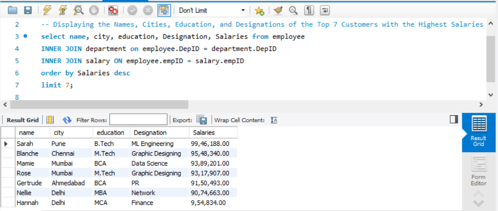
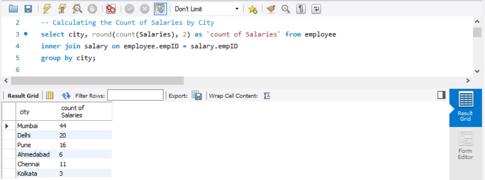
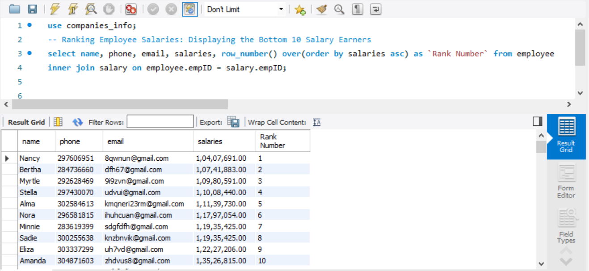

# Financial Analysis Report

## INTRODUCTION

Welcome to our in-depth Financial Analysis Report, where we meticulously analyze three crucial datasets: employee, salary, and department. In this comprehensive study, we aim to unravel valuable insights by examining the profiles of the top 7 high earners within our organization. These datasets provide a wealth of information, encompassing details such as names, cities, education backgrounds, and designations.

Beyond individual profiles, our report ventures into the geographic landscape of our workforce. By calculating the count of salaries in each city, we seek to provide a nuanced understanding of salary distribution across different locations. Furthermore, a detailed ranking of employee salaries will be presented, unveiling the bottom 10 earners and allowing for a thorough examination of the lower spectrum of our compensation structure.

The analysis extends beyond salary figures; we delve into the dynamics of yearly increments, capturing the top 5 and bottom 5 customers with the highest and lowest increments. To enrich this exploration, we've included essential details such as names, cities, and designations, along with contact information like phone numbers and emails, providing a comprehensive view of the financial landscape within our customer base.

Embark on this insightful journey with us as we decipher intricate patterns within our datasets. This report offers a strategic overview to inform decision-making processes, cultivating a profound understanding of our organizational dynamics based on robust data analysis.

## PROBLEM STATEMENT

Organizational financial analysis is pivotal for informed decision-making and equitable resource allocation. However, challenges in comprehensively understanding key financial metrics hinder our ability to optimize employee compensation and strategic planning. The following questions outline the specific areas of concern that need to be addressed to enhance our financial insights.

Questions:

 1. Display names, cities, education, and designations of the top 7 customers with the highest salaries
 2. Calculate and display the count of salaries by city
 3. Rank the employee's salaries, displaying the bottom 10 salary earners
 4. Identify and display the top 5 and bottom 5 customers with the highest and lowest yearly increments, including cities, phones, and emails.

Addressing these questions will contribute to the development of a unified and streamlined financial analysis system, fostering transparency and data-driven decision-making within the organization.

## SKILLS AND CONCEPTS TO BE DEMOSTRATED

1. Data Retrieval and Display:
   - Demonstrating the ability to retrieve and display specific information from datasets.
   - Implementing queries or commands to showcase names, cities, education, and designations of high earners.
2. Data Aggregation and Calculation:
   - Employing skills to calculate and display the count of salaries by city.
   - Understanding and implementing aggregation functions to derive meaningful insights from the data.
3. Data Ranking and Analysis:
   - Demonstrating proficiency in ranking employee salaries.
   - Analyzing and presenting the bottom 10 salary earners for thorough examination.
4. Trend Analysis and Visualization:
   - Utilizing data analysis techniques to identify trends in yearly increments.
5. Data Interpretation and Decision-Making:
   - Interpreting the extracted data to derive meaningful conclusions.
   - Demonstrating the ability to make informed decisions based on the analyzed financial metrics.
6. System Integration:
   - Integrating data from multiple datasets, including employee, salary, and department data.
   - Ensuring seamless connectivity and interoperability between different parts of the system.
   
Effectively showcasing these skills and concepts will play a pivotal role in improving the organization's data-driven decision-making processes and fostering greater financial transparency.

## ANALYSIS, DISCUSSIONS AND RESULTS

### 1. Display names, cities, education, and designations of the top 7 customers with the highest salaries?

To extract and display information about the top 7 customers with the highest salaries, we utilize SQL with the SELECT function, INNER JOIN function, ORDER BY clause, and the LIMIT function. The syntax for this operation is as follows:

```sql
SELECT Name, Cities, Education, Designation, Salaries FROM Employee
INNER JOIN Department ON Employee.DepID = Department.DepID
INNER JOIN Salary ON Employee.EmpID = Salary.EmpID
ORDER BY Salaries DESC
LIMIT 7;
```

Breaking down the syntax:
- SELECT Name, Cities, Education, Designation, Salaries: Specifies the columns to be retrieved from the combined datasets.
- FROM Employee: Indicates the primary dataset to retrieve information from.
- INNER JOIN Department ON Employee.DepID = Department.DepID: Joins the Employee and Department datasets based on the common Department ID.
- INNER JOIN Salary ON Employee.EmpID = Salary.EmpID: Further joins the Salary dataset based on the common Employee ID.
- ORDER BY Salaries DESC: Orders the result set in descending order based on the Salaries column.
- LIMIT 7: Restricts the output to the top 7 records.
  
In this syntax, the Employee dataset contains information about names and cities, while the Department dataset provides details about education and designation. The Salary dataset contributes information about salaries. The use of INNER JOINs links these datasets based on common identifiers. The result of this query reveals Sarah, located in Pune, with a B.Tech education and ML Engineering designation, as the highest salary earner, with a total salary of 99,46,188.



###  2. Calculate and display the count of salaries by city:

To determine and exhibit the count of salaries by city, the SQL query employs the SELECT function, COUNT aggregation, INNER JOIN function, and GROUP BY clause. The syntax is outlined as follows:

```sql
SELECT City, ROUND(COUNT(Salaries), 2) AS `Count_of_Salaries`
FROM Employee INNER JOIN Salary ON Employee.EmpID = Salary.EmpID
GROUP BY City;
```

Breaking down the syntax:
- SELECT City, ROUND(COUNT(Salaries), 2) AS Count_of_Salaries:
  - Selects the City column and calculates the count of salaries for each city using the COUNT aggregation.
  - The ROUND function is applied to ensure precision up to two decimal places.
  - The result is labeled as Count_of_Salaries for clarity in the output.
- FROM Employee INNER JOIN Salary ON Employee.EmpID = Salary.EmpID:
  - Specifies that the data is retrieved from the Employee and Salary datasets.
  - The INNER JOIN connects these datasets based on the common Employee ID.
- GROUP BY City:
   - Groups the result set by the City column, allowing for the aggregation function to be applied on a per-city basis.

In the context of the data, the result will showcase each city along with the corresponding count of salaries. Notably, Mumbai is identified as the city with the highest count of salaries, specifically 44. The GROUP BY clause ensures that the count is calculated for each unique city, providing a comprehensive view of salary distribution across different locations.



### 3. Rank the employee's salaries, displaying the bottom 10 salary earners:

To generate a ranking of employee salaries and display the bottom 10 earners, the SQL query utilizes the SELECT function, ROW_NUMBER function, the AS (aliasing feature), and INNER JOIN function. The syntax is provided below:

```sql
SELECT Name, Phone, Email, Salaries, ROW_NUMBER() OVER (ORDER BY Salaries ASC) AS `Rank_Number`
FROM Employee INNER JOIN Salary ON Employee.EmpID = Salary.EmpID;
```
Breaking down the syntax:
- SELECT Name, Phone, Email, Salaries, ROW_NUMBER() OVER (ORDER BY Salaries ASC) AS Rank_Number:
  - Specifies the columns to be retrieved from the combined Employee and Salary datasets.
  - Employs the ROW_NUMBER() function to assign a rank to each record based on the ascending order of salaries.
  - The AS keyword aliases the result as Rank_Number for clearer identification in the output.
- FROM Employee INNER JOIN Salary ON Employee.EmpID = Salary.EmpID:
  - Indicates that the data is retrieved by joining the Employee and Salary datasets based on the common Employee ID.

The output of this query will provide a list of employees with their names, phone numbers, emails, salaries, and a corresponding rank number based on ascending salary order. The lower the rank number, the lower the salary, allowing for easy identification of the bottom 10 earners. This approach aids in analyzing and understanding the distribution of salaries within the organization.



### 4. Identify and display the top 5 and bottom 5 customers with the highest and lowest yearly increments, including cities, phones, and emails.

To


